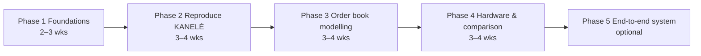

# kan-lob-engine

As of 2026-09-17

## Project Overview

Goal of kan-lob-engine: use a KAN-based LUT neural network to perform ultra-low-latency short-term price direction prediction on limit order book (LOB) data on an FPGA, with zero DSP and zero BRAM usage.

The project supports two career narratives:

- **HFT / quant FPGA roles** (IMC, Optiver, etc.): deterministic, nanosecond-scale trading signal inference, extendable into an end-to-end "packet in → signal out" system.
- **AI hardware / accelerator roles**: multiplier-free neural network inference built through hardware–software co-design.

Rationale: FPGA work at HFT firms centres on market data parsing and low latency, so ultra-low-latency inference of small models fits the industry better than "large model acceleration". KAN-LUT was only validated at a top FPGA conference in 2026, and there is little public work applying it to order books (verify with a fresh literature search before starting).

Estimated duration: 3–4 months. If an IMC assessment or interview invitation arrives, prioritise digital logic fundamentals and hand-written HDL practice.

## LUT Neural Network Fundamentals

A LUT neural network pre-enumerates an entire neuron (multiplication, summation, activation) into a truth table. Inference is pure table lookup with no arithmetic.

### Two Common Misconceptions

- **"DSPs are slow" is a misconception**: DSP blocks are hardened multipliers and are fast in themselves. Latency comes from routing between DSP columns and logic fabric, pipelining multi-stage multiply-add trees, and time-multiplexing when DSPs run out.
- **Attention belongs only to Transformers**: MLPs and CNNs have no attention. LUT networks are essentially small MLP-style structures and do not currently address LLM workloads.

### How It Works

Example: a neuron with fan-in F=3 and β=2 bits per input has 6 input bits, giving only 2^6 = 64 combinations. After training, compute the output for each combination to obtain a 64-row truth table, which maps onto a 6-input physical FPGA LUT.

The cost is exponential growth: table size is 2^(β×F), so training must enforce high sparsity and very low bit widths.

### Lineage of Academic Models

| Year | Model | Venue / Origin | Core Idea |
| --- | --- | --- | --- |
| 2026 | [KANELÉ](https://arxiv.org/abs/2512.12850) | FPGA'26 (Best Paper) | KAN edge functions mapped to LUTs; nodes only add (see next section) |
| 2025 | AmigoLUT / NeuraLUT-Assemble / [ReducedLUT](https://arxiv.org/pdf/2412.18579) | FPGA'25 and others | Ensembles of small LUT networks; compressing truth tables using don't-cares |
| 2024 | [DWN](https://arxiv.org/pdf/2410.11112) | ICML 2024 | Weightless networks with differentiably trained lookup tables |
| 2024 | [PolyLUT-Add](https://arxiv.org/pdf/2406.04910) | Imperial College and others | Summing multiple small PolyLUTs to extend fan-in |
| 2024 | NeuraLUT | FPL 2024 (Imperial College) | An entire small MLP packed into one logical LUT |
| 2023 | PolyLUT | FPT 2023 (Imperial College) | Polynomial neurons: more expressive, same table size |
| 2020 | LogicNets | FPL 2020 (Xilinx Research) | Sparsity + quantization + neurons enumerated into truth tables |
| 2019 | LUTNet | FCCM 2019 (Imperial College) | Mapping binary networks' XNOR-popcount onto LUTs |

Typical applications: CERN low-latency triggering, jet substructure classification, network intrusion detection, MNIST. Sources: [LUT network survey](https://arxiv.org/pdf/2506.07367), [AmigoLUT paper](https://dl.acm.org/doi/10.1145/3706628.3708874).

## KAN and KANELÉ

Each KAN edge is a single-input function, so each table has only 2^β entries regardless of fan-in. Hardware cost therefore grows linearly, avoiding the exponential blow-up of LogicNets.

### What Is a KAN

KAN (Kolmogorov-Arnold Network) was proposed in 2024 by Ziming Liu et al., based on the Kolmogorov-Arnold representation theorem: a multivariate continuous function can be represented as compositions and sums of univariate functions.

Author note: the paper was written during his PhD at MIT. According to his GitHub profile, he is now an Assistant Professor at Tsinghua University, was previously a postdoc at Stanford, and did his bachelor's at Peking University. The companion library is pykan.

| | MLP | KAN |
| --- | --- | --- |
| Learnable part | Numbers on edges (weights) | Functions on edges (usually B-splines) |
| Activation | Fixed, on nodes | Each edge learns its own curve |
| Node operation | Weighted sum + activation | Addition only |
| Mapping to LUTs | Table size 2^(β×F), exponential | 2^β per edge, linear |

### KANELÉ (FPGA'26)

- Authors Duc Hoang, Aarush Gupta, Philip Harris; published at FPGA'26 and won [Best Paper](https://github.com/Duchstf/KANELE); code is open source.
- The only prior KAN FPGA implementation concluded KANs were impractical. KANELÉ rewrites inference entirely as LUTs + addition, using no BRAM or DSP.
- Compared with prior KAN FPGA designs, latency drops by up to 2700× and resources by over 4000×, matching or beating other LUT networks on common benchmarks ([paper](https://arxiv.org/abs/2512.12850)).

Implication: KAN-LUT feasibility is already proven, so this project's novelty should come from the application domain and system integration.

## References

Read in order; papers are freely available on arXiv. Entries without links are cited from memory and should be verified.

| Tier | Resource | Purpose |
| --- | --- | --- |
| 1 Basics | KAN: Kolmogorov-Arnold Networks (Liu et al., 2024) + pykan | Read the first two sections and figures to build intuition |
| 1 Basics | Brevitas docs / intro to quantization-aware training | Understand low-bit-width training |
| 2 Core | LogicNets (FPL 2020) | Full flow of enumerating neurons into truth tables |
| 2 Core | PolyLUT (FPT 2023) | Relationship between expressiveness and table size |
| 2 Core | [LUT network survey](https://arxiv.org/pdf/2506.07367) | Big-picture map of the field |
| 2 Core | [KANELÉ](https://arxiv.org/abs/2512.12850) + [code](https://github.com/Duchstf/KANELE) | Core reference; read closely and run it |
| 3 Finance | FI-2010 dataset (Ntakaris et al., 2018) | Public limit order book benchmark |
| 3 Finance | DeepLOB (Zhang, Zohren, Roberts, 2019) | Label definitions and evaluation metrics |
| 4 Tools | HDLBits | Strengthen Verilog |
| 4 Tools | cocotb official docs | Writing testbenches in Python |
| 4 Tools | AMD Vivado official tutorials | Synthesis, implementation, timing and utilization reports |

## Tech Stack

The stack has three parts: software, bridge, hardware. PyTorch is not a subset of Python; it is a deep learning library used from Python. Learning order: Python → NumPy → PyTorch.

| Stage | Content |
| --- | --- |
| Software (training) | Python, NumPy, Pandas; PyTorch training loops and custom layers; quantization-aware training; dataset splits, F1, overfitting |
| Bridge (model → RTL) | Python scripts that sweep each edge's quantized inputs, export truth tables, and auto-generate Verilog (see KANELÉ code) |
| Hardware | Verilog/SystemVerilog: combinational logic, pipelining, adder trees; Vivado synthesis and timing reports (critical path, WNS) |
| Verification | cocotb or Verilator; bit-exact comparison between the Python fixed-point model and RTL |
| Advanced (optional) | Ethernet/UDP, simplified market data protocol parsing |

Dev board: none needed early on; the free edition of Vivado provides timing, utilization and power estimates. For an end-to-end network demo later, consider an entry-level Artix-7 board with an Ethernet port.

## Roadmap

Five phases; the first four take about 11–15 weeks, and phase 5 is optional.

| Phase | Tasks | Deliverable |
| --- | --- | --- |
| 1 Foundations | Learn Python/PyTorch; read the KAN paper; train a small KAN with pykan and plot edge functions | Working notebook |
| 2 Reproduce KANELÉ | Run the open-source code from training through Verilog generation; synthesize in Vivado | Reproduction results in the same range as the paper |
| 3 Order book modelling | FI-2010 feature engineering (spread, order imbalance, mid-price change); train a 3-class small KAN; sweep bit width, grid size, pruning ratio | Accuracy–resource trade-off data |
| 4 Hardware & comparison | Generate RTL; bit-exact verification with cocotb; synthesize and complete baseline comparison table | Comparison table + GitHub repo |
| 5 End-to-end (optional) | Prepend a simplified market data packet parser; measure full pipeline latency | Packet-in → signal-out demo |

## Evaluation Metrics and Baselines

The core deliverable is a baseline comparison table on the same data and the same device. Do not promise specific latency numbers in advance; report actual results and be able to explain them.

- **Model metrics**: accuracy, macro-averaged F1 (order book 3-class labels are imbalanced), accuracy loss from quantization
- **Hardware metrics**: LUT/FF counts (DSP and BRAM should be 0), Fmax, latency (clock cycles and ns), throughput (samples/s), Vivado power estimate

| Implementation | F1 | LUT | DSP | Fmax (MHz) | Latency |
| --- | --- | --- | --- | --- | --- |
| Floating-point KAN (software reference) |  | – | – | – | Measured on CPU |
| Fixed-point MLP (uses DSP; can be generated with hls4ml) |  |  |  |  |  |
| LogicNets or PolyLUT (same data) |  |  | 0 |  |  |
| **kan-lob-engine** |  |  | 0 |  |  |

## Novelty and Career Narrative

Differentiation comes from the application domain and system integration, not from re-proving that KAN-LUT works.

1. **New application domain**: little public work applies KAN-LUT to limit order book signal prediction (to be verified).
2. **Finance-specific design trade-offs**: how to choose input quantization boundaries for unevenly distributed features; the latency–accuracy Pareto curve.
3. **Interpretability**: plot edge functions to show what the model learned about order imbalance and price direction.
4. **End-to-end integration**: packet parsing → features → inference → signal; rarely done in academic papers, but exactly what HFT firms care about.

| Target Role | Narrative Focus |
| --- | --- |
| HFT / quant FPGA | Nanosecond-scale, deterministic trading signal inference; end-to-end latency |
| AI hardware / accelerators | Hardware–software co-design, multiplier-free inference, resource vs. accuracy trade-offs |

Example resume bullet:

> Implemented multiplier-free FPGA inference based on Kolmogorov-Arnold Networks for short-term price direction prediction on limit order book data: full flow from PyTorch quantization-aware training to auto-generated Verilog, zero DSP/BRAM, X clock cycles latency, Fmax X MHz, with LUT usage at X% of a fixed-point MLP baseline at equal F1.

## Appendix: MX Formats

MX (Microscaling) is a formal open standard, but its 4-bit tier competes with NVIDIA's NVFP4. It could serve as a follow-up second project that connects to LLM trends.

- **Principle**: data is split into blocks sharing an 8-bit power-of-two scale factor, so hardware only needs shifts. MXFP4 uses 32 elements per block, 136 bits in total.
- **Standardisation**: AMD, Arm, Intel, Meta, Microsoft, NVIDIA and Qualcomm released v1.0 through OCP in September 2023, defining MXFP8/MXFP6/MXFP4/MXINT8.
- **Competition**: NVFP4 uses 16 elements per block, with higher accuracy but more overhead; MXFP4 is more hardware-efficient but lags in accuracy.
- **Project idea**: implement an MX-format vector dot product / matrix multiply unit, comparing area, frequency and accuracy across INT8, FP8 and MXFP4.

## Sources

- [KANELÉ paper (arXiv 2512.12850)](https://arxiv.org/abs/2512.12850)
- [KANELÉ code repository](https://github.com/Duchstf/KANELE)
- [LUT network survey (arXiv 2506.07367)](https://arxiv.org/pdf/2506.07367)
- [AmigoLUT (FPGA'25)](https://dl.acm.org/doi/10.1145/3706628.3708874)
- [PolyLUT-Add](https://arxiv.org/pdf/2406.04910)
- [DWN](https://arxiv.org/pdf/2410.11112)
- [ReducedLUT](https://arxiv.org/pdf/2412.18579)
- [OCP MX alliance announcement](https://www.opencompute.org/blog/amd-arm-intel-meta-microsoft-nvidia-and-qualcomm-standardize-next-generation-narrow-precision-data-formats-for-ai)
- [OCP MX formats explainer (FPRox)](https://fprox.substack.com/p/ocp-mx-scaling-formats)
- [MXFP4 vs NVFP4 comparison paper (arXiv 2603.08713)](https://arxiv.org/html/2603.08713)
